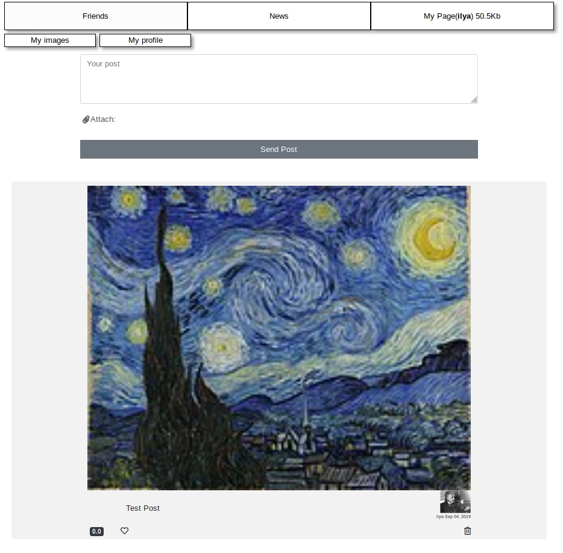

# 640Kb Social Network

This is a social network. Its main feature is the limitation of user space.
The limit is 640Kilobytes.
The next feature of this network is inverse proportional likes, so the more space you use the less your likes are.
Other functions are similiar to most popular social networks:
- Add posts
- Load images
- Add/Remove friends
- Chat with friends
- Browse news
## Simple view of main page

<br>
[Read more about this project](doc/article.md)

## Getting Started

This project developed for running in the docker container.
So if you have `docker` and `docker-compose` installed on your local machine - that will be enough to run this project.
Steps to run project for test purpose:
```bash
git clone https://github.com/86Ilya/net640kb
cd net640kb
bash deploy-develop.sh
```
After that web server will starts on localhost on 8080 port, so ensure that you don't have running anything on this port.

### Prerequisites

To install docker follow instructions on page
https://docs.docker.com/install/

## Running the tests
To run the tests you need to deploy the app in develop mode
```bash
bash deploy-develop.sh
```
and exec in running web container the next command:
```bash
docker exec -it net640kb_web_1 python manage.py test
```
After finishing tests you will see the number of failed and completed test cases.
## Built With

* [Django](https://www.djangoproject.com/) - The backend web framework used
* [Postgresql](https://www.postgresql.org/) - The database
* [Redis](https://redis.io/) - Key value storage used in django channels
* [Daphne](https://github.com/django/daphne) - ASGI service
* [Vue.js](https://vuejs.org/) - The javascript framework used
* [Twitter Bootstrap](https://getbootstrap.com/) - CSS styles and rules

## Versioning

We use [SemVer](http://semver.org/) for versioning.

## Authors

* **Ilya Aurov** - *Initial work* - [Ilya](https://github.com/86Ilya)

## License

This project is licensed under the MIT License - see the [LICENSE.md](LICENSE.md) file for details

## Link
The current stage of the project is alpha testing. [www.640kb.fun](https://www.640kb.fun/)
